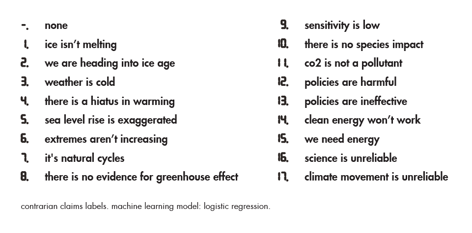

Critical Climate Machine
========================

Gaëtan Robillard, installation repository, 2022.

Critical Climate Machine (Patterns of Heat) is a research based project that quantifies and reveals the mechanisms of online misinformation about global warming.

This code has been developed by Gaëtan Robillard and Jolan Goulin, as part of the project [MediaFutures](#mediafutures) and [»The Intelligent Museum«](#the-intelligent-museum).

For information on usage and redistribution, and for a DISCLAIMER OF ALL WARRANTIES, see the file, "LICENSE.txt," in this distribution.

BSD Simplified License.

Description
-----------

Critical Climate Machine is examining different states of digital (mis)information about climate change, especially when interpreted by machine learning algorithms. The artistic project takes shape in an installation that presents processed information both in real time, through natural language processing techniques, and in the form of dialogues that were voiced, then regenerated and spatialized, with the help of algorithms designed for music analysis and improvisation. Overall, the work consists of a data sculpture, a visualization and a sound installation. This repository concerns the code for the data sculpture.

**Hardware**

Crafted of wood and copper, the data sculpture is made up of a network of thirty-two units (by modules of 4), each housing a processor displaying outputs on a row of 7-segment LED displays. A main device collects data from Twitter and reads and writes the data in a database (DB).

**Software**

The software collects tweets from 44 skeptical accounts linked to American conservatives lobbies. On top of the query, a list of 91 keywords are used to filter the claim research, with keywords such as "Antarctica", "IPCC" (Intergovernmental Panel on Climate Change) or "fossil fuel". A third of the keyword list is based on research in political science focusing on the rejecting of scientific consensus on global warming by the American public and legislators (Boussalis and Coan, 2016). In the installation, the new database is automatically updated every four minutes.

Following a scenario based on a time loop, the most recent 896 tweets are distributed as new inputs and spatialized in the sculpture network. Each unit then predicts, classifies and displays labels of misleading claims on the fly.

### Structure

Four main modules compose the current software architecture:

1. `/claim_monitor`, on main device
2. `/machine_learning`, on a network of pi zero devices
3. `scenario.py`, on main device

The claim monitor and the scenario are both connected to a mongoDB database.

| Role        | Hardware                           | Software module                |
|-------------|------------------------------------|--------------------------------|
| Main device | pi 4                               | Claim monitor and Scenario     |
| Unit        | pi zero w and 56 digits LED row    | Machine learning               |
| Network     | netgear router                     | ...                            |

`start.sh` is a bash script for autorun of `claim_monitor/cl_monitor.py` on main device.

### 1. Claim monitor

*Runs on main device*

The module watches Twitter accounts for recent tweets and saves them in the DB.

Use `cl_monitor.py` to:

- monitor accounts through Twitter API (Twitter developper account needed)
- writes collected tweets in the DB
- classify most recent tweets from the DB (cf Subroutine)
- writte the classification output as a new attribute in the DB

**Subroutine**

`ml_upd_db.py` is used to classify tweets and write their labels in the DB, by using the trained ML model from `data/model.pkl`. `nTweets` is a variable used to limit for the number of inputs to run through the model.

### 2. Machine learning

*Runs on each raspberry of the network, i.e. 32 units (pi zero)*

For every cycle of the scenario (cf Scenario), each unit receives and classifies 28 new tweets. There are 18 labels ranging from 0 to 17.

Warning: the text below is clearly identified in the realm of cognitive sciences as known misleading claims about climate change. It should be recalled here that **97% of climate experts agree humans are causing global warming** (Cook et al., 2016).

`server.launch` runs `server.py` at unit startup. `server.py` receives data and instructions from the main device over wifi network.

See `ml.py` for machine learning inference and `model.pkl`, the trained model.

### 3. Scenario

*Runs on main device*

The scenario works as a cycle for collecting data from the DB and distributing it in the network.

Use `scenario.py` to:

- connect to the DB
- create a list of 32 sub lists of 28 tweets
- distribute each sublist to 32 IPs, via OSC protocol

**Network**

`network.py` is used to manage the pi zero network (32 servers) from the command line.
Possible inputs are: `update`, `halt`, `reboot`.

Requirements
------------

Dependencies (python librairies)

* scikit-learn
* numpy
* pymongo
* pymongo[srv]
* pickle
* pythonosc

Data
-------

### Disclaimer

It was decided to publish here part of the machine learning model training dataset. This training set originates from a large number of documents from prominent American conservative think tanks and contrarian blogs. The data consists of 23 436 paragraphs labeled by climate-literate volunteers according to five known types of misleading arguments about climate change[^1]. Ethical aspects have been taken into account. One of the reason for publishing is based on transparency. As an investigation of science, the artistic project aims to critically expose a process of computation together with its intellectual and material implications. Revealing the basis on which is grounded the production of new data and its analysis relies on an effort to exhibit processes – and aspects of natural language processing more specifically. Beforehand, excerpts from the training set were presented and discussed in an open workshop called _The Refutation Game_, where participants were encouraged to learn more about climate misinformation and rebuttal techniques.

To date, no negative impact has been identified in relation to the dissemination of the training data. The dataset in question is completely anonymized. It does not include the names of authors, lobbies or blogs from which the data may have been collected. From a technical point of view, the sharing of this dataset enables the retraining of the model, in the event that the provided model cannot be read, due to possible updates in the dependencies of the software. Please note that the training data does not include the test set. To access the full training dataset and learn more about its method, please refer to Travis G. Coan et al., in the References section below.

For any claim regarding the publication of the training dataset in the current repository, please contact gaetanrobillard.studio@gmail.com.

Path for accessing the training data : `machine_learning/dataset-training/training.csv`

To train the model and export new `.pkl` file, use `trainExportModel.py`.

[^1]: The five top categories of the training set: 1) it’s not happening, 2) it’s not us, 3) it’s not bad, 4) solutions won’t work, 5) climate science is unreliable. For a full list of categories, please refer to Travis G. Coan et al. (Figure 1, sub-claims level).

### Note

Publishing the new twitter data in the Critical Climate Machine framework – in open data – is in progress. It invloves the cooperation between Robillard and Eurecat, Centre Tecnològic de Catalunya.

References / Further Reading
----------------------------

Critical Climate Machine (Patterns of Heat) short video presentation [on vimeo](https://vimeo.com/667971904).

Training set and analysis code is extended from article by Travis G. Coan, Constantine Boussalis, John Cook, and Mirjam Nanko, "Computer-assisted classification of contrarian claims about climate change", _Sci Rep 11_, 22320, Nature, 2021. [https://doi.org/10.1038/s41598-021-01714-4](https://doi.org/10.1038/s41598-021-01714-4)

Tips
-----------

Use [cheat-sheet](cheat-sheet.md) to get few tips for debugging the installation.

MediaFutures
--------------

Critical Climate Machine is part of the MediaFutures project. It has received funding from the European Union’s framework Horizon 2020 for
research and innovation programme under grant agreement No 951962.

The Intelligent Museum
----------------------

An artistic-curatorial field of experimentation for deep learning and visitor participation

The [ZKM | Center for Art and Media](https://zkm.de/en) and the [Deutsches Museum Nuremberg](https://www.deutsches-museum.de/en/nuernberg/information/) cooperate with the goal of implementing an AI-supported exhibition. Together with researchers and international artists, new AI-based works of art will be realized during the next four years (2020-2023). They will be embedded in the AI-supported exhibition in both houses. The Project „The Intelligent Museum” is funded by the Digital Culture Programme of the [Kulturstiftung des Bundes](https://www.kulturstiftung-des-bundes.de/en) (German Federal Cultural Foundation) and funded by the [Beauftragte der Bundesregierung für Kultur und Medien](https://www.bundesregierung.de/breg-de/bundesregierung/staatsministerin-fuer-kultur-und-medien) (Federal Government Commissioner for Culture and the Media).

As part of the project, digital curating will be critically examined using various approaches of digital art. Experimenting with new digital aesthetics and forms of expression enables new museum experiences and thus new ways of museum communication and visitor participation. The museum is transformed to a place of experience and critical exchange.

