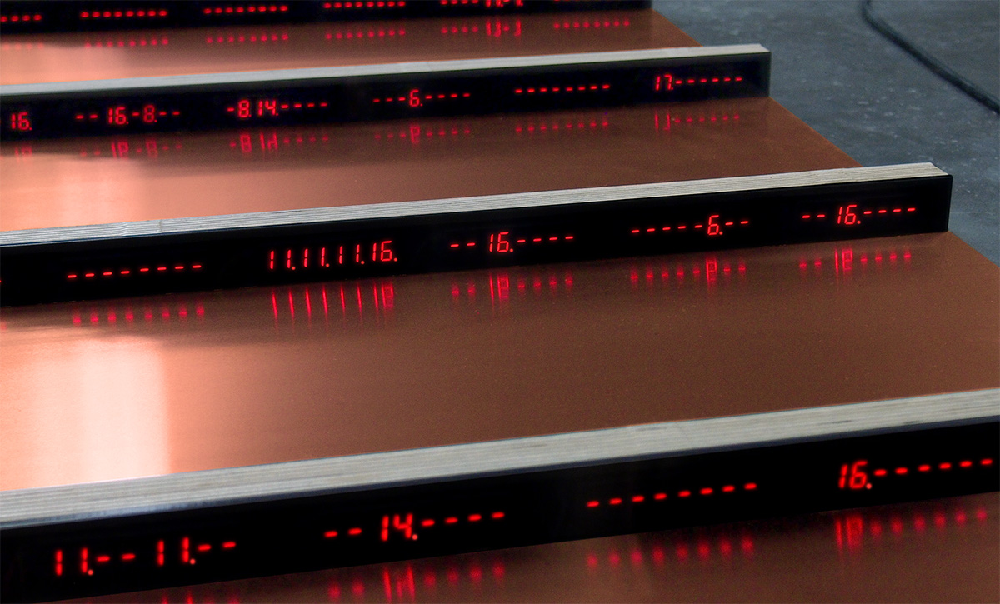

Critical Climate Machine
========================

Gaëtan Robillard, installation repository, 2022.

Critical Climate Machine is a research based project that quantifies and reveals the mechanisms of online misinformation about global warming.

This code has been developed by Gaëtan Robillard and Jolan Goulin, as part of the project [MediaFutures](#mediafutures) and [»The Intelligent Museum«, ZKM](#the-intelligent-museum).

Training set and analysis code is extended from article by Travis G. Coan, Constantine Boussalis, John Cook, and Mirjam Nanko, "Computer-assisted classification of contrarian claims about climate change", _Sci Rep 11_, 22320, Nature, 2021. [https://doi.org/10.1038/s41598-021-01714-4](https://doi.org/10.1038/s41598-021-01714-4)

--------------------------------------------------------

Updates

- Specifications about the modification of code
- Disclaimer about training dataset
- Footers (IM residency and MediaFutures)

--------------------------------------------------------

Description
-----------

_The project consists of a data sculpture based on machine learning algorithms, a visualization and a sound installation. Made with wood and copper, the data sculpture is composed by a network of thirty two units, each embedding one processor (pi zero wifi) displaying outputs on a row of 7 segments LED displays (56 digits per row). A main device (pi 4) runs the collection of data from Twitter and reads and writes the data on a Data Base. This repository concerns the code for the data sculpture._

### Structure

Three main modules compose the current architecture:

1. `/claim_monitor`, on main device
2. `/machine_learning`, on a network of pi zero devices
3. `scenario.py`, on main device

The scenario and the claim monitor are connected to a mongoDB database.

`start.sh` is a bash script for autorun of `claim_monitor/cl_monitor.py` on main device.

### 1. Claim monitor

*Runs on main device*

The module watches Twitter accounts for recent tweets and saves them in the database.

Use `cl_monitor.py` to:

- monitor accounts through Twitter API (Twitter developper account needed)
- writes collected tweets in the Data Base
- classify most recent tweets from the DB (cf Subroutine)
- writte the classification output as a new attribute in the DB

**Subroutine**

`ml_upd_db.py` is used to classify tweets and write their labels in the DB, by using the trained ML model from `data/model.pkl`. `nTweets` is a variable used to limit for the number of inputs to run through the model.

### 2. Machine learning

*Runs on each raspberry of the network, i.e. 32 units (pi zero)*

For every cycle of the scenario (cf Scenario), each unit receives and classifies 28 tweets. There are 18 labels ranging from 0 to 17.

`server.launch` runs `server.py` at the unit startup. `server.py` receives data and instructions from the main device over wifi network.

See `ml.py` for ML inference and `model.pkl`, the trained model.

### 3. Scenario

*Runs on main device*

The scenario works as a cycle for collecting data from the DB and distributing it in the network.

Use `scenario.py` to:

- connect to the DB
- create a list of 32 sub lists of 28 tweets
- distribute each sublist to 32 IPs, via OSC protocol

**Network**

`network.py` is used to manage the pi zero network (32 servers) from the command line.
Possible inputs are: `update`, `halt`, `reboot`

Other
-----------

Use [cheat-sheet](cheat-sheet.md) to get few tips for debugging the installation

--------------------------------------------------------

Critical Climate Machine is part of the MediaFutures project. It has received funding from the European Union’s framework Horizon 2020 for
research and innovation programme under grant agreement No 951962.
Critical Climate Machine – Patterns of Heat is an artistic research within the framework of the Intelligent Museum Residency, Hertz Lab, ZKM
Center for Art and Media Karlsruhe.
